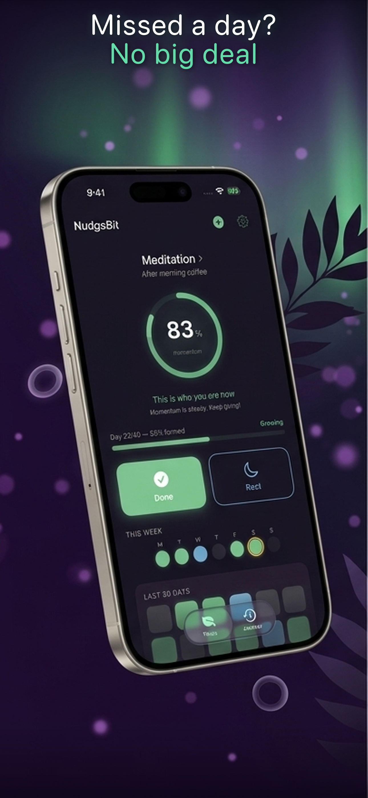
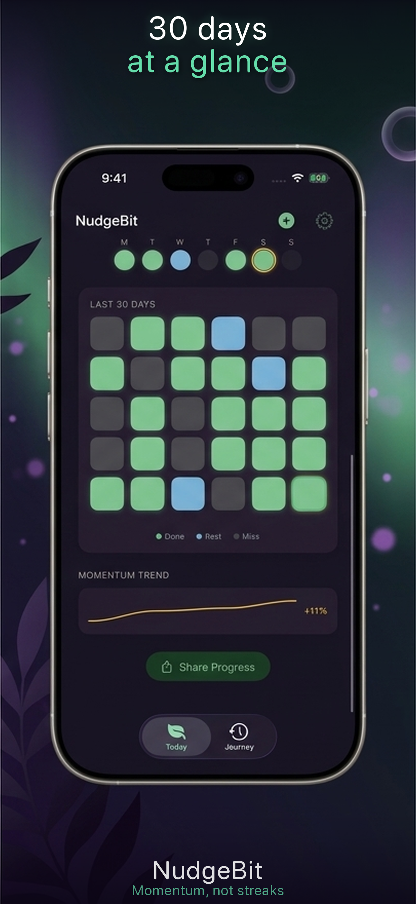
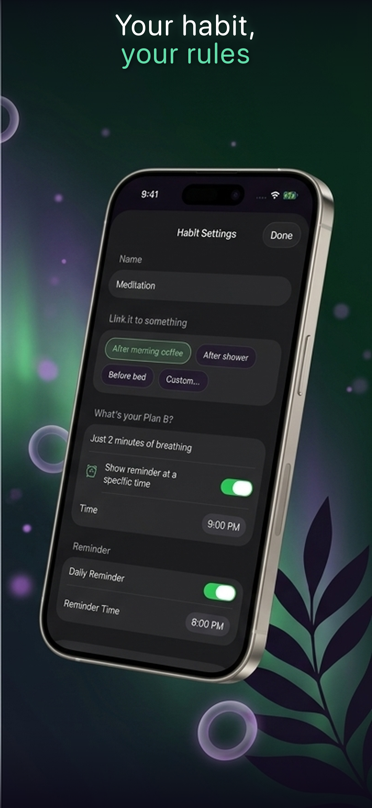

# 🌊 NudgeBit — Gentle Habit Tracker

**No streaks. No guilt. Just momentum.**

Habit tracker that measures your momentum instead of punishing you for missing a day.

## Download

**[App Store (iOS)](https://apps.apple.com/app/id6761635225)** — free, no ads, no subscription

**[Web version](https://magic-dev-kz.github.io/drift/)** — single HTML file, works offline

## Screenshots

  
  
  

## Why NudgeBit?

Most habit trackers celebrate your 30-day streak with a fire emoji — then reset you to zero when you miss one day. That cycle of guilt is why 80% of people quit within two weeks. NudgeBit replaces streaks with momentum: miss a day and your score dips from 86% to 71%. Not to zero. Never to zero.

## Features

- **Momentum, Not Streaks** — rolling 7-day window, not binary pass/fail
- **Rest Days Are a Feature** — tap Rest and your momentum stays the same
- **Habit Formation Score** — science-based 66-day tracker, from seed to rooted
- **Start With One Habit** — grow to three only when momentum stays above 70%
- **Momentum Ring** — shifts from lavender to gold as you build consistency
- **28-Day Heatmap** — green for done, blue for rest, gray for missed. No red. Ever
- **Gentle Phrases** — "Every step matters" at 30%, "This is who you are now" at 90%
- **iCloud Sync** — data on device, optional sync across devices

## iOS App

Native SwiftUI app with full momentum tracking, rest day support, habit formation science, and iCloud sync.

- Requires iOS 17+
- Built with SwiftUI + iCloud

## Web Version

Single HTML file PWA (~21KB) — vanilla JS, zero frameworks, works offline. Your data stays in your browser (localStorage).

## Privacy

All data on your device. iCloud sync is optional. No tracking, no analytics, no server. [Privacy Policy](https://mdk.guru/apps/drift/privacy)

## Built by

One person + AI agents at [MDK.GURU](https://mdk.guru)

## License

MIT
